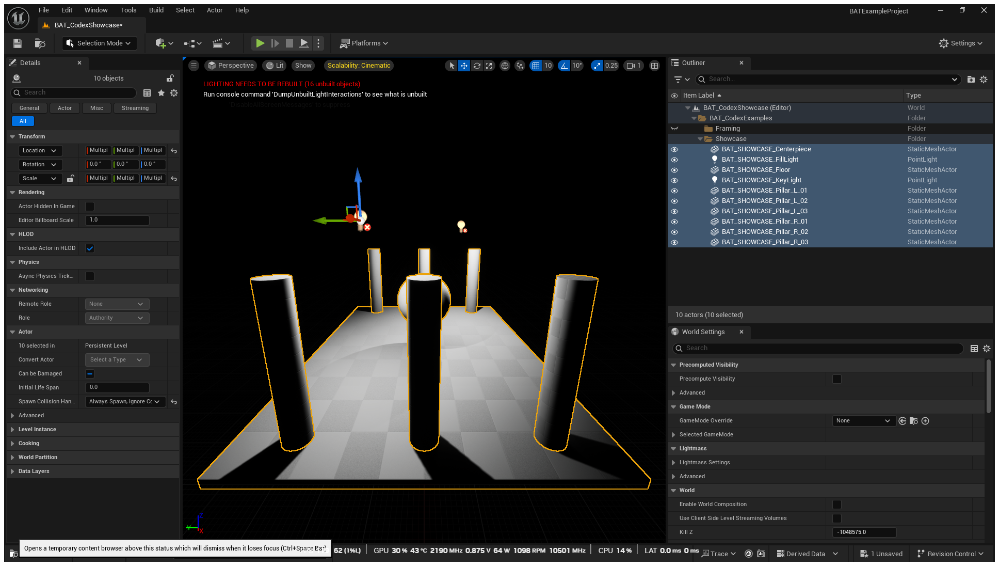
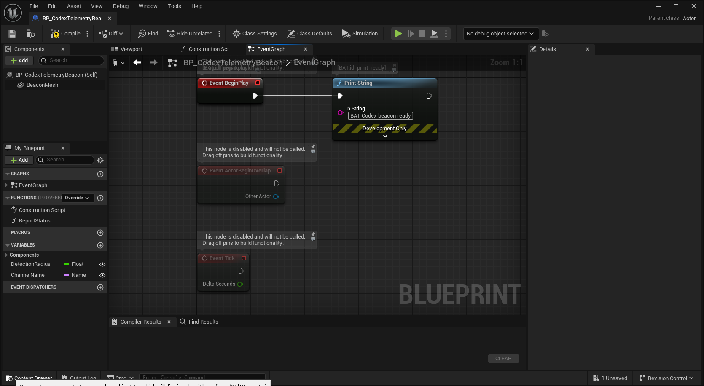
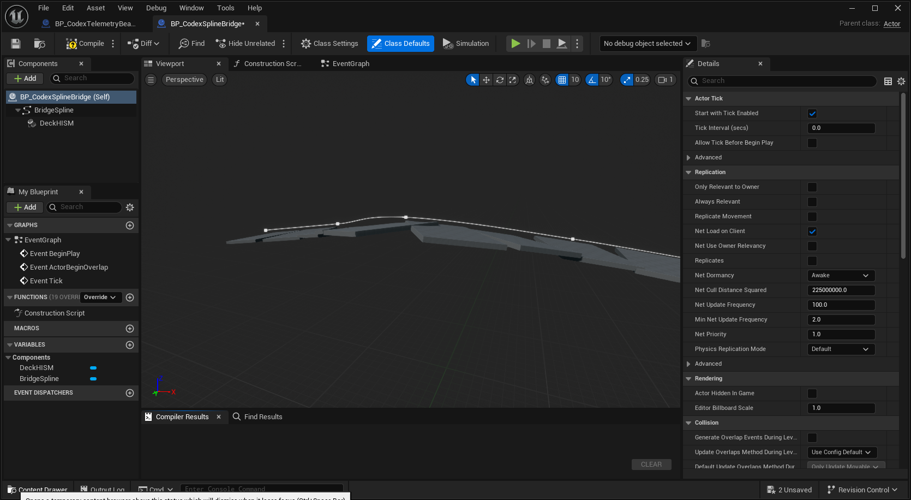
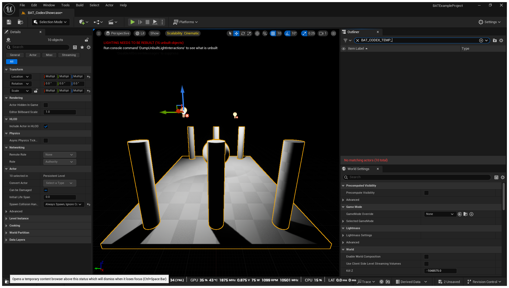
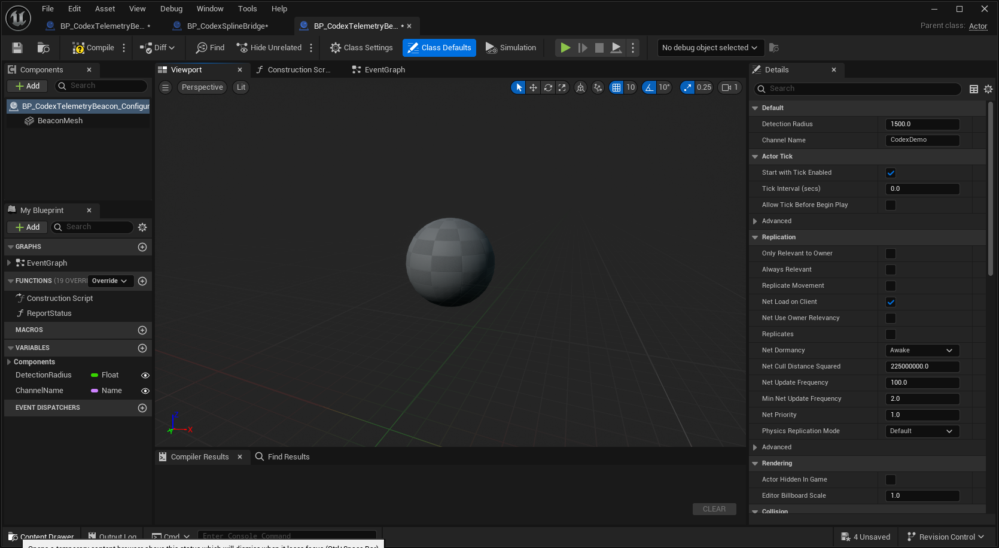
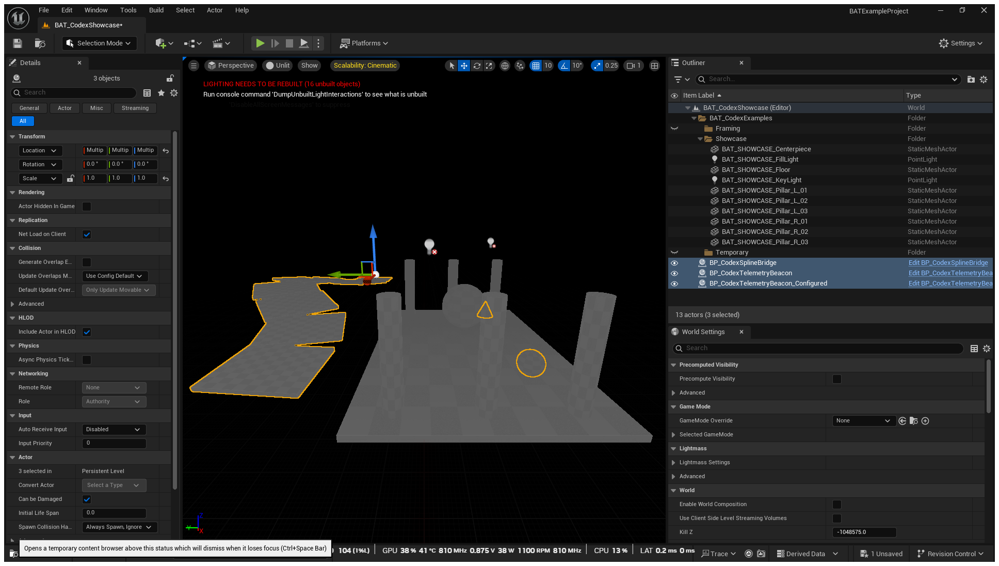
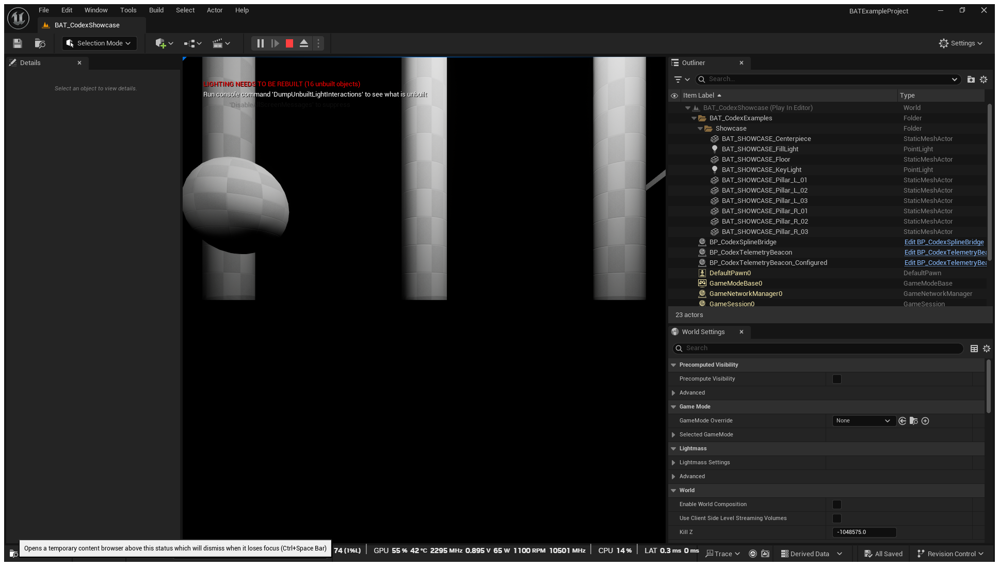
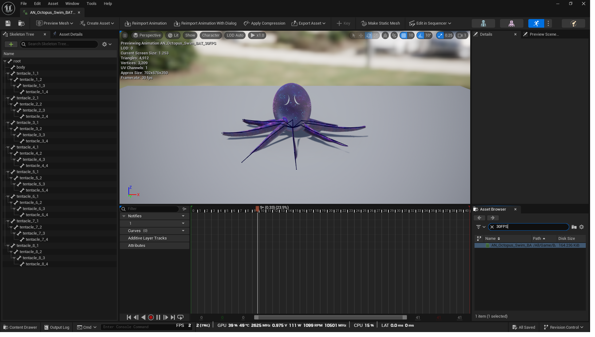

# Codex Executed Examples

These examples were issued as natural-language prompts to Codex and executed
against a live Unreal Editor on July 28, 2026. Codex discovered the active
Blueprint Automation Toolkit (BAT) API, translated each prompt into typed
localhost requests, inspected the resulting editor state, and reported the
evidence below.

Every example now follows the same evidence order:
**Codex prompt → Unreal Editor result screenshot → BAT route trace → structured
verification output**. The screenshots were captured from the live UE 5.5.4
editor immediately after the corresponding prompt reached its demonstrable
result state. The PIE screenshot was captured during the bounded play phase;
the final API read-back below verifies that PIE was stopped afterward.

## Test Environment

- Unreal Engine: `5.5.4-0+UE5` source build
- BAT protocol: `1.0`
- Safe Mode: enabled
- Exec route: disabled
- Python execution: disabled
- Transport: authenticated loopback HTTP

Volatile request and job IDs are omitted from the condensed output. The bearer
token is redacted and is not stored in this repository.

## 1. Discover Capabilities and Build a Showcase Map

### Codex prompt

> Work through BAT in the open Unreal Editor. Discover the engine and safety
> gates first. Create `/Game/BAT_CodexExamples/Maps/BAT_CodexShowcase`, then
> build a centered ten-actor showcase with one floor, six pillars, one sphere
> centerpiece, and two point lights. Put every actor under
> `BAT_CodexExamples/Showcase`, tag it `BAT_CodexExample`, audit the result, and
> save only if no actor or property is rejected.

### Unreal Editor result



The viewport and World Outliner show the generated floor, six pillars,
centerpiece, and two lights.

### BAT route trace

`GET /engine/discover` → `GET /ai/capabilities` →
`POST /editor/level/create` → `POST /ai/editor/layout/apply` →
`GET /jobs/{jobId}` → `POST /editor/level/audit` →
`POST /editor/level/save`

### BAT verification output (condensed)

```json
{
  "engine": "5.5.4-0+UE5",
  "protocol": "1.0",
  "safeMode": true,
  "execEnabled": false,
  "pythonEnabled": false,
  "layout": {
    "created": 10,
    "spawned_actors": 10,
    "rejected_actors": 0,
    "applied_properties": 38,
    "rejected_properties": 0,
    "errors": []
  },
  "audit": {
    "matchedCount": 10,
    "countsByClass": {
      "StaticMeshActor": 8,
      "PointLight": 2
    }
  },
  "save": {
    "saved": true,
    "mapSaved": true,
    "mapPackage": "/Game/BAT_CodexExamples/Maps/BAT_CodexShowcase"
  }
}
```

Included artifact:
`Examples/BATExampleProject/Content/BAT_CodexExamples/Maps/BAT_CodexShowcase.umap`

## 2. Create a Data-Driven Blueprint in One Plan

### Codex prompt

> Create
> `/Game/BAT_CodexExamples/Blueprints/BP_CodexTelemetryBeacon` as an Actor
> Blueprint in one BAT plan. Add instance-editable `DetectionRadius` and
> `ChannelName` variables, a `ReportStatus` function, and a movable
> `BeaconMesh` static mesh component using the engine cone. In `EventGraph`,
> connect BeginPlay to PrintString with `BAT Codex beacon ready`. Compile,
> inspect the schema and graph links, and save only when compilation has no
> errors.

### Unreal Editor result



The Blueprint editor shows the generated execution link and the exact
`BAT Codex beacon ready` string. The Components, Functions, and Variables
panels also expose the other generated members.

### BAT route trace

`POST /blueprint/apply` → `POST /blueprint/compile_save` →
`POST /blueprint/schema` → `GET /blueprint/graph/links`

### BAT verification output (condensed)

```json
{
  "apply": {
    "created": 1,
    "variables_added": 2,
    "functions_added": 1,
    "components_added": 1,
    "components_updated": 1,
    "compiled": true,
    "errors": []
  },
  "compileSave": {
    "saved": true,
    "compileStatus": "up_to_date",
    "errorCount": 0,
    "warningCount": 0
  },
  "schema": {
    "variables": ["DetectionRadius", "ChannelName"],
    "instanceEditableVariables": 2,
    "component": "BeaconMesh",
    "function": "ReportStatus"
  },
  "eventGraph": {
    "nodeCount": 5,
    "verifiedLink": "begin_play.then -> print_ready.execute"
  }
}
```

Included artifact:
`Examples/BATExampleProject/Content/BAT_CodexExamples/Blueprints/BP_CodexTelemetryBeacon.uasset`

## 3. Generate a Spline-Driven HISM Blueprint

### Codex prompt

> Create
> `/Game/BAT_CodexExamples/Blueprints/BP_CodexSplineBridge` as an Actor
> Blueprint. Add `BridgeSpline` with five curve points. Add `DeckHISM` using
> `/Engine/BasicShapes/Cube.Cube`, generate its instances from the spline every
> 200 units, align them to the tangent, and apply a thin bridge-deck scale.
> Compile, list the resulting components, and save only with zero compiler
> errors.

### Unreal Editor result



The Blueprint viewport shows the five-point spline and the bridge deck
generated from `DeckHISM`; both component names are visible in the Components
panel.

### BAT route trace

`POST /blueprint/create` → `GET /jobs/{jobId}` →
`POST /blueprint/set-defaults` with `components_apply` →
`POST /blueprint/compile_save` → `POST /blueprint/apply` with
`components.list`

### BAT verification output (condensed)

```json
{
  "create": {
    "succeeded": true
  },
  "componentsApply": {
    "applied": ["BridgeSpline", "DeckHISM"]
  },
  "compileSave": {
    "saved": true,
    "compileStatus": "up_to_date",
    "errorCount": 0,
    "warningCount": 0
  },
  "components": [
    {"name": "BridgeSpline", "class": "SplineComponent"},
    {"name": "DeckHISM", "class": "HierarchicalInstancedStaticMeshComponent"}
  ]
}
```

Included artifact:
`Examples/BATExampleProject/Content/BAT_CodexExamples/Blueprints/BP_CodexSplineBridge.uasset`

## 4. Perform a Guarded Actor Cleanup

### Codex prompt

> Create three temporary cube actors under
> `BAT_CodexExamples/Temporary`, each tagged `BAT_CodexCleanup`. Audit that
> exact scope, preview deletion with a dry run and an explicit maximum of three,
> perform the real deletion only if the counts match, then audit again to prove
> that zero matching actors remain.

### Unreal Editor result



The post-cleanup Outliner filter reports `No matching actors (10 total)`. The
structured read-back below proves that the guarded scope contained three
actors before deletion and zero afterward.

### BAT route trace

`POST /ai/editor/layout/apply` → `GET /jobs/{jobId}` →
`POST /editor/level/audit` → `POST /editor/level/destroy_actors`
with `dryRun: true` → `POST /editor/level/destroy_actors` with
`dryRun: false` → `POST /editor/level/audit`

### BAT verification output (condensed)

```json
{
  "spawned": 3,
  "auditBefore": {
    "matchedCount": 3,
    "labels": [
      "BAT_CODEX_TEMP_01",
      "BAT_CODEX_TEMP_02",
      "BAT_CODEX_TEMP_03"
    ]
  },
  "dryRun": {
    "matchedCount": 3,
    "destroyedCount": 0,
    "failedCount": 0
  },
  "delete": {
    "matchedCount": 3,
    "destroyedCount": 3,
    "failedCount": 0
  },
  "auditAfter": {
    "matchedCount": 0
  }
}
```

This example intentionally leaves no asset behind.

## 5. Duplicate, Configure, and Verify a Blueprint Variant

### Codex prompt

> Duplicate `BP_CodexTelemetryBeacon` as
> `BP_CodexTelemetryBeacon_Configured`. On the duplicate only, update the
> existing `BeaconMesh` in place: use the engine sphere, make it movable, move
> it to Z 125, and scale it uniformly to 1.25. Compile and save the duplicate.
> List the source and destination components afterward and prove that both
> still contain exactly one component named `BeaconMesh`.

### Unreal Editor result



The duplicate's Blueprint viewport shows the sphere result while the Components
panel shows one component named `BeaconMesh`.

### BAT route trace

`POST /asset/duplicate` → `POST /blueprint/apply` with `components.set` →
`POST /blueprint/compile_save` → `POST /blueprint/apply` with
`components.list` for source and destination

### BAT verification output (condensed)

```json
{
  "duplicate": {
    "createdCount": 1,
    "savedCount": 1
  },
  "configure": {
    "components_updated": 1,
    "compiled": true,
    "errors": []
  },
  "compileSave": {
    "saved": true,
    "errorCount": 0,
    "warningCount": 0
  },
  "sourceComponents": [
    {"name": "BeaconMesh", "class": "StaticMeshComponent"}
  ],
  "destinationComponents": [
    {"name": "BeaconMesh", "class": "StaticMeshComponent"}
  ]
}
```

Included artifact:
`Examples/BATExampleProject/Content/BAT_CodexExamples/Blueprints/BP_CodexTelemetryBeacon_Configured.uasset`

## 6. Place and Audit the Generated Blueprints

### Codex prompt

> In `BAT_CodexShowcase`, spawn one instance each of
> `BP_CodexTelemetryBeacon`, `BP_CodexTelemetryBeacon_Configured`, and
> `BP_CodexSplineBridge` at distinct locations. Audit actors whose class name
> contains `BP_Codex`, report the count per generated class, and save the map
> only if all three resolve.

### Unreal Editor result



The viewport shows the bridge, cone beacon, and configured sphere beacon
selected together. The World Outliner and Details panel both report three
selected generated actors.

### BAT route trace

`POST /actor/spawn` three times → `POST /editor/level/audit` →
`POST /editor/level/save`

### BAT verification output (condensed)

```json
{
  "spawned": 3,
  "audit": {
    "matchedCount": 3,
    "countsByClass": {
      "BP_CodexTelemetryBeacon_C": 1,
      "BP_CodexTelemetryBeacon_Configured_C": 1,
      "BP_CodexSplineBridge_C": 1
    }
  },
  "saved": true
}
```

The three actors are included in `BAT_CodexShowcase.umap`.

## 7. Run a Bounded PIE Lifecycle Check

### Codex prompt

> Confirm that PIE is stopped, start PIE through BAT, verify that the capability
> state reports PIE running, then stop PIE in a guaranteed cleanup step and
> verify that the final state reports PIE stopped. Do not mutate editor assets
> while PIE is active.

### Unreal Editor result



This screenshot was captured during the bounded PIE phase. The active pause and
stop controls, `Play In Editor` world label, and runtime-only actors provide
visual evidence of the running state; the final read-back below confirms the
guaranteed stop completed.

### BAT route trace

`GET /ai/capabilities` → `POST /pie/start` →
`GET /ai/capabilities` → `POST /pie/stop` →
`GET /ai/capabilities`

### BAT verification output (condensed)

```json
{
  "before": {"pieRunning": false},
  "during": {"pieRunning": true},
  "after": {"pieRunning": false}
}
```

This example intentionally leaves no asset behind.

## 8. Build and Animate a Textured Rigged Octopus

### Codex prompt

> In the open Unreal Engine 5.5 editor, use Unreal's standard content import
> step for the octopus source package in `SourceArt/AnimatedOctopus`, placing
> the result under `/Game/BAT_CodexExamples/Octopus`. Confirm that the result is
> a textured `SkeletalMesh` bound to `SK_Octopus_Skeleton`, with eight
> four-bone tentacle chains plus root and body bones. Then use BAT's typed
> `POST /asset/create` animation workflow to create
> `AN_Octopus_Swim_BAT_30FPS`: 30 fps, 41 frames, 33 tracks covering the root
> and every tentacle bone, a seamless phase-shifted swimming wave, Unreal `+X`
> forward, and immediate save. Open the animation in Unreal Editor, display
> the full skeleton over the textured mesh, and return BAT class,
> relationship, texture-profile, animation, focus, and save evidence.

### Unreal Editor result



[Watch the 10-second Unreal Editor animation capture (H.264 MP4,
1936×1096).](Videos/CodexExecutedExamples/08-animated-octopus.mp4)

The live Animation Editor shows the indigo and cyan textured octopus at frame 9
of the generated swim sequence. The 34-bone Skeleton Tree is expanded at left,
all tentacle bones are drawn over the skeletal mesh, the viewport reports 4,912
triangles and 30 fps, and the timeline exposes the 41 sampled frames.

### Source preparation boundary

BAT does not currently expose a model-import endpoint. Codex therefore prepared
the deterministic glTF skeletal mesh plus base-color and normal-map source
files, then imported them with Unreal's unattended content pipeline. The
included source manifest reports 34 bones: root, body, and eight four-bone
tentacle chains. Animation authoring, object resolution, relationship reads,
texture-profile inspection, asset focus, and the final nine-asset save were
performed through typed BAT routes.

### BAT route trace

`GET /engine/discover` → `POST /asset/create` for `AnimSequence` →
`POST /object/resolve` for mesh, skeleton, material, textures, and animation →
`GET /object/get_property` for mesh and animation relationships →
`GET /object/describe` for texture profiles →
`POST /editor/focus` → `POST /asset/save`

### BAT verification output (condensed)

```json
{
  "engine": "5.5.4-0+UE5",
  "safeMode": true,
  "createAnimation": {
    "path": "/Game/BAT_CodexExamples/Octopus/AN_Octopus_Swim_BAT_30FPS",
    "skeleton": "/Game/BAT_CodexExamples/Octopus/SK_Octopus_Skeleton.SK_Octopus_Skeleton",
    "preview_mesh": "/Game/BAT_CodexExamples/Octopus/SK_Octopus.SK_Octopus",
    "frame_rate": 30,
    "number_of_frames": 41,
    "tracks": 33,
    "forward_axis": "X",
    "saved": true
  },
  "resolvedClasses": {
    "SK_Octopus": "SkeletalMesh",
    "SK_Octopus_Skeleton": "Skeleton",
    "M_Octopus_Skin": "MaterialInstanceConstant",
    "T_Octopus_BaseColor": "Texture2D",
    "T_Octopus_Normal": "Texture2D",
    "AN_Octopus_Swim_BAT_30FPS": "AnimSequence"
  },
  "relationships": {
    "meshSkeleton": "SK_Octopus_Skeleton",
    "animationSkeleton": "SK_Octopus_Skeleton",
    "sequenceLength": 1.3666667
  },
  "textureProfiles": {
    "T_Octopus_BaseColor": {"sRGB": true},
    "T_Octopus_Normal": {"sRGB": false, "flipGreenChannel": true}
  },
  "focusMode": "asset",
  "save": {"savedCount": 9, "errors": []}
}
```

Included project artifacts:

- `Examples/BATExampleProject/Content/BAT_CodexExamples/Octopus/` contains the
  skeletal mesh, skeleton, physics asset, three materials, two textures, and
  the BAT-authored animation.
- `Examples/BATExampleProject/SourceArt/AnimatedOctopus/` contains the glTF
  source package, base-color and normal textures, and the source manifest.
- `Docs/Videos/CodexExecutedExamples/08-animated-octopus.mp4` records the live
  animation result in Unreal Editor.

## Observed Boundaries and Corrections

- `components_apply` supports `SplineComponent`, `InstancedStaticMeshComponent`,
  and `HierarchicalInstancedStaticMeshComponent`. It explicitly rejects
  `SplineMeshComponent`; the README and advanced prompt guide were corrected to
  match the implementation.
- Updating an existing component with `components.set` preserved the component
  name and source asset. It is used in the verified variant example instead of
  a remove-and-add replacement.
- The run exposed map-save extension handling in the generic asset saver. The
  implementation now detects world packages and writes `.umap`, and the level
  save route directly saves the active map before optional dirty content
  packages.

## Repository Artifact Verification

The source changes and committed example artifacts were verified after the
prompt run:

```json
{
  "pluginBuild": {
    "engine": "5.5.4-0+UE5",
    "platform": "Win64",
    "result": "BUILD SUCCESSFUL"
  },
  "packageValidation": {
    "packagesConsidered": 4,
    "packagesLoadedAndResaved": 4,
    "errors": 0
  },
  "octopusPackageValidation": {
    "engine": "5.5.4-0+UE5",
    "packagesConsidered": 9,
    "packagesLoadedAndResaved": 9,
    "errors": 0
  },
  "mapCheck": {
    "errors": 0,
    "warnings": 0
  },
  "finalMapAudit": {
    "matchedCount": 3
  },
  "levelSave": {
    "saved": true,
    "mapSaved": true
  },
  "genericAssetSave": {
    "savedCount": 1,
    "mapFiles": ["BAT_CodexShowcase.umap"]
  }
}
```

## Reproducing the Examples

1. Install or build BAT for the Unreal Engine version used by the host project.
2. Open `Examples/BATExampleProject/BATExampleProject.uproject`.
3. Configure a new bearer token locally and start the BAT server.
4. Give Codex the reusable safety preamble from
   [`AdvancedPromptExamples.md`](AdvancedPromptExamples.md), followed by one of
   the prompts above.
5. Ask Codex to return route traces, compiler diagnostics, read-back evidence,
   and save status.

The committed example defaults keep the server disabled, Safe Mode enabled,
and exec and Python disabled. Authentication remains a local user choice.
